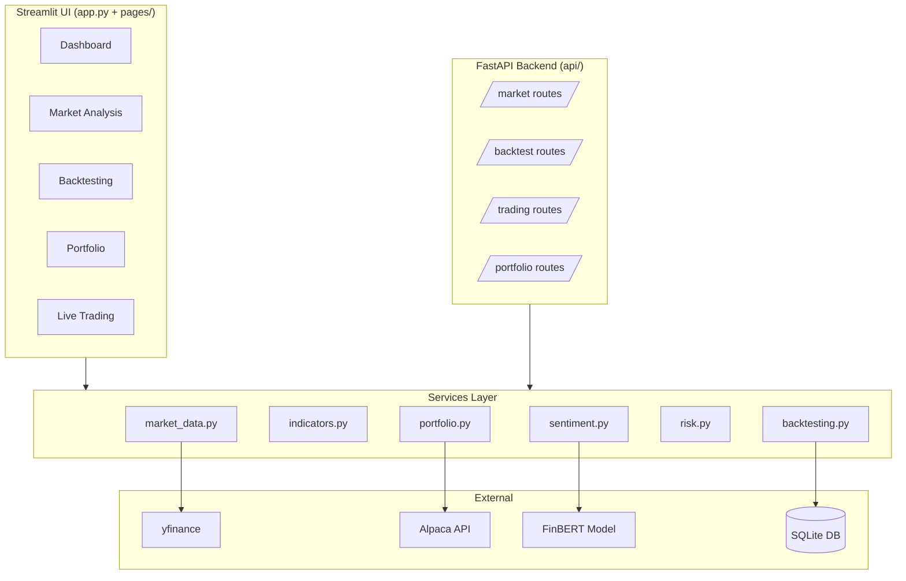

# QuantEdge — Quantitative Trading Platform

<div align="center">


</div>


A professional-grade quantitative trading system combining FinBERT sentiment analysis, technical indicators, and algorithmic strategies for systematic market participation. Features a full Streamlit dashboard, FastAPI REST backend, comprehensive backtesting engine, and live trading via Alpaca Markets.

---

## Platform Preview

```
┌──────────────────────────────────────────────────────────────────────┐
│                       QuantEdge  |  Dashboard                        │
├──────────────┬──────────────┬───────────────┬────────────────────────┤
│  Dashboard   │Market Analysis│  Backtesting  │  Portfolio & Trading   │
│              │               │               │                        │
│  SPY  +0.4%  │  Candlestick  │  Equity Curve │  AAPL  10 shares       │
│  QQQ  +0.6%  │  + BB / SMA   │  Drawdown     │  TSLA   5 shares       │
│  AAPL  quote │  RSI  |  MACD │  Trade Log    │  Place Order           │
│  Sector Map  │  Sentiment    │  Metrics Grid │  Auto Strategy         │
└──────────────┴───────────────┴───────────────┴────────────────────────┘
```

---

## Features

**Market Analysis**
- Real-time price data and candlestick charts via yfinance
- 12+ technical indicators: RSI, MACD, Bollinger Bands, Stochastics, ATR, OBV, Williams %R, CCI, VWAP
- Moving averages: SMA 20/50/200, EMA 9/21
- Automated signal detection with bullish/bearish classification
- Sector performance heatmap and market movers

**ML Sentiment Analysis**
- FinBERT (ProsusAI/finbert) for financial news NLP
- Per-headline and aggregate sentiment scoring
- Sentiment breakdown chart with positive/negative/neutral distribution
- News feed integration via yfinance

**Backtesting Engine**
- Three built-in strategies: Momentum, Mean Reversion, ML Sentiment
- Configurable parameters: RSI thresholds, Bollinger Band width, sentiment threshold
- Performance metrics: Sharpe ratio, Sortino ratio, Calmar ratio, max drawdown, win rate, profit factor
- Interactive equity curve and drawdown charts
- Full trade log with entry/exit details

**Portfolio Management**
- Live position tracking via Alpaca API
- Unrealized P&L by position
- Portfolio allocation pie chart
- Historical performance per symbol

**Live Trading**
- Manual order placement with bracket orders (take profit + stop loss)
- Sentiment-driven automated strategy runner
- Open order management and cancellation
- Paper and live trading support

**REST API (FastAPI)**
- `/api/market/quote/{symbol}` — real-time quote
- `/api/market/indicators/{symbol}` — full indicator set
- `/api/market/sentiment/{symbol}` — FinBERT sentiment
- `/api/backtest/run` — async backtest execution
- `/api/portfolio/positions` — live positions
- `/api/trading/order` — order placement

---

## Architecture



---

## Project Structure

```
quantedge/
├── app.py                   # Streamlit main entry point
├── run.py                   # Launch UI, API, or both
├── pages/
│   ├── 1_Dashboard.py       # Market overview and watchlist
│   ├── 2_Market_Analysis.py # Charts and technical analysis
│   ├── 3_Backtesting.py     # Strategy backtesting
│   ├── 4_Portfolio.py       # Portfolio and positions
│   ├── 5_Live_Trading.py    # Order placement and automation
│   └── 6_Settings.py        # API credentials and defaults
├── api/
│   ├── main.py              # FastAPI application
│   └── routes/              # market, portfolio, backtest, trading
├── core/
│   ├── config.py            # Pydantic settings
│   └── database.py          # SQLAlchemy engine
├── models/
│   ├── orm.py               # Database models
│   └── schemas.py           # Pydantic schemas
├── services/
│   ├── market_data.py       # yfinance data fetching
│   ├── sentiment.py         # FinBERT inference
│   ├── indicators.py        # Technical analysis
│   ├── backtesting.py       # Backtesting engine
│   ├── risk.py              # Risk metrics
│   └── portfolio.py         # Alpaca broker integration
├── strategies/
│   ├── base.py              # Abstract base strategy
│   ├── momentum.py          # RSI + MACD momentum
│   ├── mean_reversion.py    # Bollinger Band reversion
│   └── ml_sentiment.py      # FinBERT sentiment strategy
└── tests/
    ├── test_indicators.py
    └── test_risk.py
```

---

## Installation

**Prerequisites:** Python 3.10+

```bash
git clone https://github.com/punyamodi/QuantEdge.git
cd QuantEdge
pip install -r requirements.txt
```

**Environment Setup**

Copy `.env.example` to `.env` and fill in your credentials:

```bash
cp .env.example .env
```

```env
ALPACA_API_KEY=your_api_key
ALPACA_API_SECRET=your_api_secret
ALPACA_BASE_URL=https://paper-api.alpaca.markets
```

Get free paper trading API keys at [alpaca.markets](https://alpaca.markets).

---

## Usage

**Launch the Streamlit dashboard**

```bash
streamlit run app.py
```

Opens at `http://localhost:8501`

**Launch the FastAPI REST backend**

```bash
python run.py api
```

API runs at `http://localhost:8000` — interactive docs at `/docs`

**Launch both together**

```bash
python run.py both
```

**Run tests**

```bash
pytest tests/ -v
```

---

## Strategies

| Strategy | Signal Sources | Key Parameters |
|---|---|---|
| Momentum | RSI + MACD crossover | RSI oversold/overbought thresholds, volume filter |
| Mean Reversion | Bollinger Bands | Band width multiplier, RSI confirmation, mid-band exit |
| ML Sentiment | FinBERT news NLP | Confidence threshold, technical confirmation required |

---

## Risk Metrics

| Metric | Description |
|---|---|
| Sharpe Ratio | Risk-adjusted return vs risk-free rate |
| Sortino Ratio | Sharpe using only downside volatility |
| Calmar Ratio | Annualized return divided by max drawdown |
| Max Drawdown | Largest peak-to-trough equity decline |
| Win Rate | Percentage of profitable closed trades |
| Profit Factor | Gross profit divided by gross loss |
| VaR (95%) | Value at Risk at 95% confidence |
| CVaR | Conditional VaR (expected shortfall) |
| Beta | Correlation of returns vs benchmark |
| Alpha | Excess return above benchmark |

---

## Backtesting Example

```
Strategy: Mean Reversion  |  Symbol: SPY  |  2021-01-01 to 2023-12-31
──────────────────────────────────────────
 Initial Capital :  $100,000.00
 Final Equity    :  $114,823.50
 Total Return    :    +14.82%
 Sharpe Ratio    :      1.23
 Sortino Ratio   :      1.87
 Max Drawdown    :     -8.4%
 Win Rate        :     64.3%
 Profit Factor   :      2.1
 Total Trades    :       28
──────────────────────────────────────────
```

---

## Code Examples

**Run a backtest programmatically**

```python
from services.backtesting import BacktestEngine

engine = BacktestEngine(initial_capital=100_000.0)
result = engine.run_mean_reversion_strategy(
    symbol="SPY",
    start_date="2022-01-01",
    end_date="2023-12-31",
    bb_window=20,
    bb_std=2.0,
    rsi_filter=True,
)
print(result)
```

**Run sentiment analysis**

```python
from services.sentiment import estimate_sentiment

headlines = [
    "Fed signals rate cuts ahead, markets rally",
    "Strong earnings beat expectations across tech sector",
]

probability, sentiment = estimate_sentiment(headlines)
print(f"{sentiment}  ({probability:.1%})")
# positive  (94.3%)
```

**Fetch indicators**

```python
from services.indicators import TechnicalIndicators

df = TechnicalIndicators.compute_all("AAPL", period="6mo")
print(df[["close", "rsi", "macd", "bb_upper", "bb_lower"]].tail())
```

---

## Disclaimer

This software is for educational and research purposes only. It does not constitute financial advice. Trading involves substantial risk of loss. Past performance of backtested strategies does not guarantee future results. Always test with paper trading before using real capital.

---

## Legacy Code

The original MLTrader script using Lumibot is preserved on the [`legacy`](https://github.com/punyamodi/QuantEdge/tree/legacy) branch.
